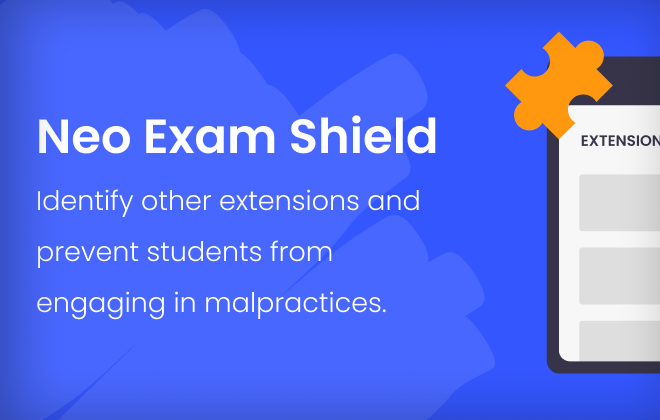

# NeoExamShield Extension

**NeoExamShield** is an AI-powered browser companion extension designed for students taking tests on **Iamneo / Examly**, **HackerRank**, **NPTEL courses** (Wildlife Ecology, Conservation Geography, Forest Management, etc.), and other online assessment portals.

---

> [!IMPORTANT]
> **API Key Setup**: NeoExamShield puts you in full control. Configure your own AI API key by clicking the extension icon and navigating to the **Settings** tab.  
> **Supported Providers**: OpenAI, Google Gemini, Anthropic Claude, DeepSeek, and Custom API endpoints.

> [!WARNING]
> **Educational Purposes Only**: This extension is intended for educational and research purposes. Please use it responsibly and adhere to academic integrity policies.

---

## ✨ Features

- **`Iamneo / Examly Integration`**:
  - Automatically search Neo coding answers using AI.
  - Type coding solutions character-by-character with realistic typing simulation (<kbd>Alt</kbd> + <kbd>T</kbd> / <kbd>Option</kbd> + <kbd>T</kbd>).
- **`Universal AI Solver`**:
  - Search code and answers directly from selected text (<kbd>Ctrl</kbd> + <kbd>.</kbd> / <kbd>Control</kbd> + <kbd>.</kbd>).
  - Solve single-choice & multiple-choice MCQs from selected text (<kbd>Ctrl</kbd> + <kbd>,</kbd> / <kbd>Control</kbd> + <kbd>,</kbd>).
- **`AI Chatbot Overlay`**:
  - Floating, draggable AI assistant overlay (<kbd>Alt</kbd> + <kbd>C</kbd> / <kbd>Option</kbd> + <kbd>C</kbd>).
  - Markdown rendering and full contextual chat support.
- **`Screen Share Spoofing & Bypass`**:
  - Bypass full-screen restrictions during proctored screenshares.
  - Choose between **Share Tab/Window**, **Share Blank Screen**, or **Share Frozen Screen**.
- **`Restricted Paste & Clipboard Interceptor`**:
  - Paste content even when portals block standard paste (<kbd>Ctrl</kbd> + <kbd>V</kbd> or <kbd>Alt</kbd> + <kbd>P</kbd> for Drag-and-Drop paste).
- **`HackerRank Solver`**:
  - Solve HackerRank coding questions (<kbd>Alt</kbd> + <kbd>K</kbd> / <kbd>Option</kbd> + <kbd>K</kbd>).
- **`NPTEL Integration`**:
  - Built-in questions and answers database for NPTEL courses (<kbd>Alt</kbd> + <kbd>,</kbd> / <kbd>Option</kbd> + <kbd>,</kbd>).
- **`Bring Your Own API Key (BYOK)`**:
  - Connect your OpenAI, Anthropic Claude, Google Gemini, DeepSeek, or custom API endpoints securely.

---

## ⬇️ Installation

### Chromium-based Browsers (Chrome, Brave, Edge, Opera)
1. Clone or download this repository as a ZIP and extract it.
2. Open your browser and navigate to `chrome://extensions/`.
3. Enable **Developer mode** in the top right corner.
4. Click **Load unpacked** and select the folder containing `manifest.json`.
5. NeoExamShield is now installed!

### Firefox
1. Build the Firefox package using `scripts/build-firefox-release.ps1` or load the extension as a temporary add-on via `about:debugging#/runtime/this-firefox`.
2. Select the `manifest.json` file.

---

## 💻 Configuration & Usage

1. Click the **NeoExamShield** icon in your browser toolbar.
2. In the **Settings** tab:
   - Select your preferred **AI Provider** (OpenAI, Claude, Gemini, DeepSeek, or Custom).
   - Enter your **API Key**.
   - (Optional) Specify a custom model name or endpoint.
3. Click **Test Connection** to confirm connectivity.
4. Use the keyboard shortcuts below while on your exam portals.

---

## ⌨️ Keyboard Shortcuts

### Windows & Linux:
| Shortcut | Action | Requirement |
| :--- | :--- | :--- |
| <kbd>Alt</kbd> + <kbd>A</kbd> | Search Neo Answers Using AI | On Iamneo Portal |
| <kbd>Alt</kbd> + <kbd>T</kbd> | Type Neo Coding Solution Letter-by-Letter | On Iamneo Portal |
| <kbd>Alt</kbd> + <kbd>K</kbd> | Solve HackerRank Questions | On HackerRank |
| <kbd>Ctrl</kbd> + <kbd>.</kbd> | Search Answers Using AI | Select question text first |
| <kbd>Ctrl</kbd> + <kbd>,</kbd> | Solve MCQs Using AI | Select question text first |
| <kbd>Alt</kbd> + <kbd>,</kbd> | Solve NPTEL MCQs | Select question text first |
| <kbd>Alt</kbd> + <kbd>C</kbd> | Toggle Floating AI Chatbot | Any page |
| <kbd>Alt</kbd> + <kbd>P</kbd> | Paste via Drag & Drop Simulation | Active input/editor |
| <kbd>Ctrl</kbd> + <kbd>V</kbd> | Standard Intercepted Paste | Active input/editor |
| <kbd>Alt</kbd> + <kbd>O</kbd> | Toggle Toast Notification Opacity | Any page |

### macOS:
| Shortcut | Action | Requirement |
| :--- | :--- | :--- |
| <kbd>Option</kbd> + <kbd>A</kbd> | Search Neo Answers Using AI | On Iamneo Portal |
| <kbd>Option</kbd> + <kbd>T</kbd> | Type Neo Coding Solution Letter-by-Letter | On Iamneo Portal |
| <kbd>Option</kbd> + <kbd>K</kbd> | Solve HackerRank Questions | On HackerRank |
| <kbd>Control</kbd> + <kbd>.</kbd> | Search Answers Using AI | Select question text first |
| <kbd>Control</kbd> + <kbd>,</kbd> | Solve MCQs Using AI | Select question text first |
| <kbd>Option</kbd> + <kbd>,</kbd> | Solve NPTEL MCQs | Select question text first |
| <kbd>Option</kbd> + <kbd>C</kbd> | Toggle Floating AI Chatbot | Any page |
| <kbd>Option</kbd> + <kbd>P</kbd> | Paste via Drag & Drop Simulation | Active input/editor |
| <kbd>Cmd</kbd> + <kbd>V</kbd> | Standard Intercepted Paste | Active input/editor |
| <kbd>Option</kbd> + <kbd>O</kbd> | Toggle Toast Notification Opacity | Any page |

---

## 🤝 Contributing & Datasets

To contribute to question datasets (e.g., NPTEL):
1. Fork this repository.
2. Use the script in `nptel.txt` on your course assignments to extract JSON data.
3. Update `data/nptel.json`.
4. Submit a Pull Request.

---

## 📄 License

This project is open source and available under the [MIT License](LICENSE).
